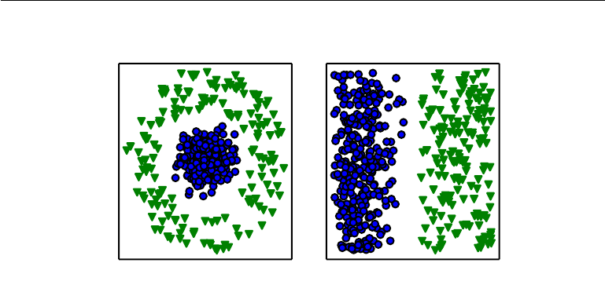

## Artificial Intelligence (AI)

#### Credits

> [DeepLearningBook.org](http://www.deeplearningbook.org/)

_All/most of the content in this page is copied from the above mentioned book.
All credits goes to it's authors and I copied the statements, images from it which I thought, will be useful
for future reference.
_

### AI in the past

In the past AI projects hard-coded the knowledge into the computer about formal languagues
using logical inference rules. This approach is known as the **knowledge base** approach to AI.
None of these projects hasled to a major success.

In the early days, the field rapidly tackled and solved problems that are intellectually difficult
for human beings but relatively straight-forward for computers—problems that can be described by a
list of formal, mathematical rules.

The true challenge to artificial intelligence proved to be solvingthe tasks that are easy
for people to perform but hard for people to describe formally--problems that we solve intuitively,
that feel automatic, like recognizingspoken words or faces in images.

### AI in current times

To solve more intuitive problems, we have to make computers to learn from experience and understand the
world in terms of heirarchy of concepts, with each concept defined through its relation to simpler concepts.

If we draw a graph showing how these concepts are built on top of each other,
the graph is deep, with many layers. For this reason, we call this approach to AI **deep learning**.

The difficulties faced by systems relying on hard-coded knowledge suggest that
AI systems need the ability to acquire their own knowledge,
by extracting patterns from raw data. This capability is known as **machine learning**.

Deep learning is the sub-field of Machine Learning,
Machine Learning is the sub-field of Aritficial Intelligene.

#### Machine Learning

A simple **machine learning** algorithm called **logistic regression** can determine whether
to recommend cesarean delivery.

A simple **machine learning** algorithm called **naive bayes** can separate
legitimate e-mail from spam e-mail.

The performance of these simple machine learning algorithms depends heavily
on the **representation** of the data they are given.

Each piece of information included in the representation of the data is known as a **feature**.

Logistic regression learns how each of these features of the patient correlates with various outcomes.

In computer science, operations such as searching a collection of data can proceed
exponentially faster if the collection is **structured** and **indexed** intelligently.

**For example**

<small>
  _In the plot on the left, we represent some data using **Cartesian
  coordinates**, and the task to seperate the data is not possible. In the the
  right, we represent the data with **polar coordinates** and the task becomes
  simple to solve with a vertical line._
</small>

One solution to this problem is to use machine learning to discover not only
the mapping from representation to output but also the representation itself.
This approach is known as **representation learning**.
