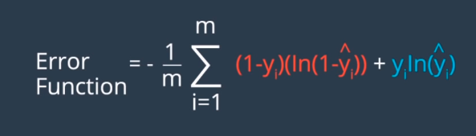
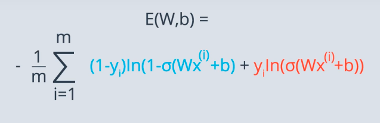

import {Link} from "gatsby"

## Logistic Regression

Now, we're finally ready for one of the most popular and useful algorithms in Machine Learning,
and the building block of all that constitutes Deep Learning. The Logistic Regression Algorithm.
And it basically goes like this:

1. Take your data
2. Pick a random model (just random weights and bais)
3. <Link to="logistic-regression#formulaforerrorfunction">Calculate the error</Link>
4. <Link to="logistic-regression#minimizingtheerrorfunction">Minimize the error</Link>
5. And obtain a better model (update the weights and bais accordingly, repeat from step 3)

### Formula For Error Function

### Minimizing the Error Function

To minimize the error function we make use of the gradiant descent, first we calculate the gradient using
the formula

